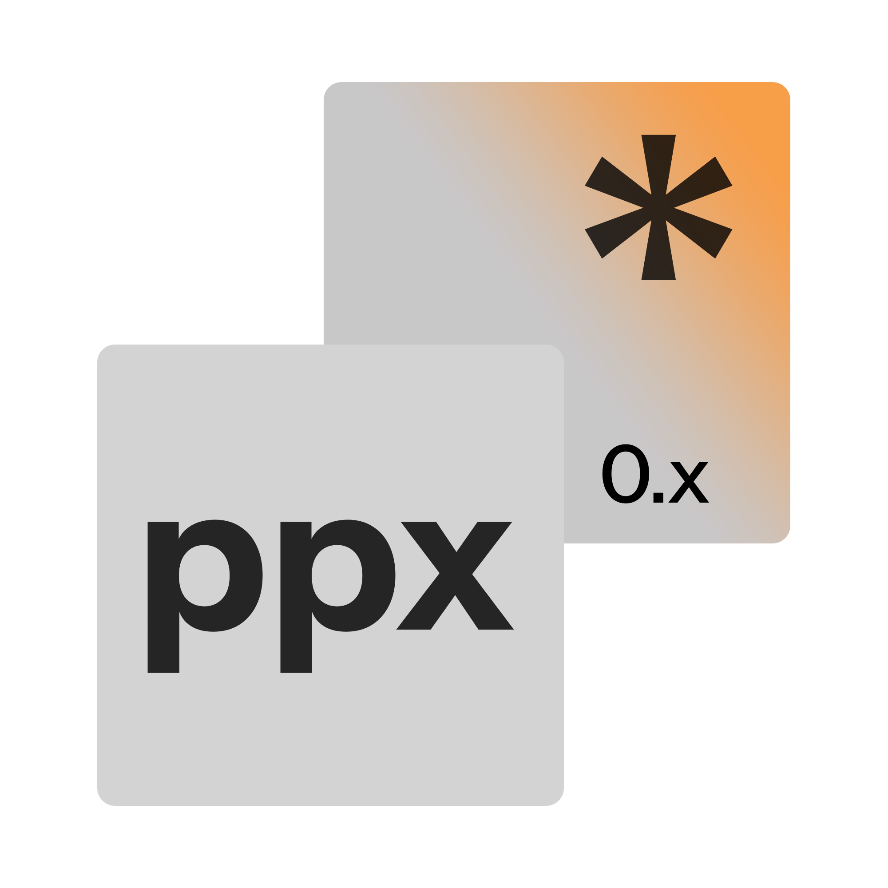

## PyPassPlex

PyPassPlex is a Python package which generates secure and customisable passwords and passphrases.

> [!NOTE]
> This project has been built upon the core API of [my old password generator](https://github.com/LukeS-05/generate-password).
>
> Learn more at https://lukes-05.github.io/pypasskit/features.html

## Features
🔑 Generate cryptographically secure passwords with the secrets module.

⚙️ Customisation features allowing you to generate passwords fitting a certain criteria.

🧠 A guarantee that all your chosen character types are included.

🖋️ Calculates password entropy.

**Just like all my other projects...**

- 🖥️ Open source and easy to inspect. 
- 🚫 No internet access required 
- 🔒 No data is collected or stored

## License
The code is licensed under the MIT license. You can find a copy of this available [here](https://github.com/LukeS-05/pypasskit/blob/main/LICENSE).
